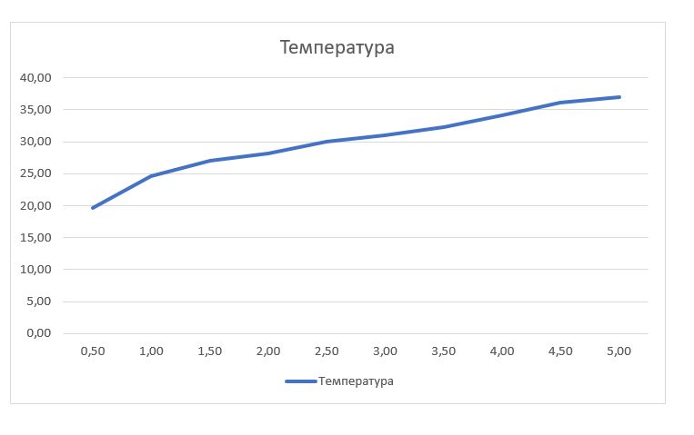
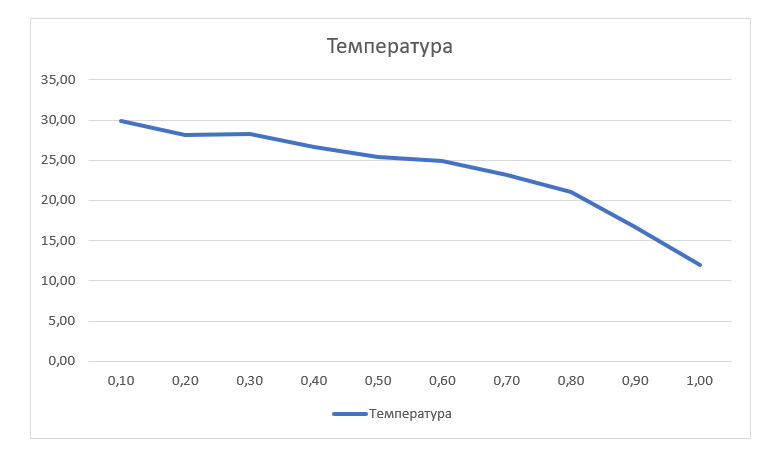
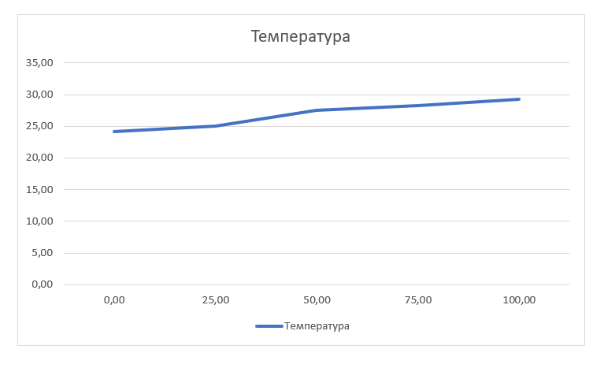

## Комп'ютерні системи імітаційного моделювання
## СПм-22-6, **Паронікян Папін Арменович**
### Лабораторна робота №**1**. Опис імітаційних моделей та проведення обчислювальних експериментів

### Варіант 2, модель у середовищі NetLogo:
[Climate Change](http://www.netlogoweb.org/launch#http://www.netlogoweb.org/assets/modelslib/Sample%20Models/Earth%20Science/Climate%20Change.nlogo)

 

### Вербальний опис моделі:
Це модель потоку енергії у землі, зокрема теплової енергії. На ньому центр землі зображений рожевим кольором, поверхня планети представлена зеленою смугою. Над смугою блакитна атмосфера та чорний космос угорі. В атмосфері можуть бути хмари та молекули вуглекислого газу (CO2). Молекули CO2 є парниковими газами, які блокують інфрачервоне випромінювання, випромінюване Землею. Хмари блокують вхідні або вихідні сонячні промені, впливаючи на нагрівання чи охолодження планети.

### Керуючі параметри:
- Повзунок **SUN-BRIGHTNESS** контролює скільки сонячної енергії потрапляє в атмосферу Землі. Значення 1,0 відповідає нашому Сонцю. Вищі значення дозволяють побачити, що сталося б, якби Земля виявилася ближчою до Сонця або якби Сонце стало яскравішим.
- Повзунок **ALBEDO** контролює, скільки сонячної енергії, що падає Землю, поглинається. Якщо альбедо дорівнює 1,0, Земля відбиває все сонячне світло. Це могло б статися, якби земля замерзла, і на це вказує біла поверхня. Якщо альбедо дорівнює нулю, Земля поглинає все сонячне світло. Це позначається чорною поверхнею. Альбедо Землі становить близько 0,6.
- Ви можете додавати та видаляти хмари за допомогою кнопок - **add cloud**, **remove cloud**. Хмари блокують сонячне світло, але не ІЧ.
- Ви можете додавати та видаляти парникові гази, представлені у вигляді молекул CO2 -  - **add CO2**, **remove CO2**. CO2 блокує ІЧ-світло, але не сонячне світло. Кнопки додають та віднімають молекули групами від 25 до 150.

### Внутрішні параметри:
- **sky-top** -  визначає місцезнаходження верхнього рядка неба у моделі.
- **earth-top** - визначає положення верхнього рядка земної поверхні у моделі, встановлюючи межу між поверхнею Землі та атмосферою.
- **temperature** - відображає загальну температуру Землі у моделі та відтворює стан теплової енергії на планеті. Визначається на основі кількості червоних точок у моделі.
- **cloud-speed** - вказує на швидкість переміщення хмар у атмосфері.
- **cloud-id** - слугує унікальним ідентифікатором конкретної хмари у моделі. Використовується для відстеження та управління конкретними хмарами в системі.
  
### Показники роботи системи:
- **Global Temperature** - графік глобальної температури на планеті за весь час симуляції. Температура землі пов'язана з кількістю тепла в землі. Чим більше червоних точок ви бачите, тим гарячіше.
- **temperature** - точне значення температури в даний момент.
- **CO2s** - точна кількість молекул CO2 в атмосфері в даний момент.

### Примітки:
- Молекулам CO2 "заборонено" виходити за межі синіх патчів, встановлюючи важливе обмеження на їхній рух і зберігаючи їх в області атмосфери, де вони взаємодіють з іншими елементами.
- Початкова температура Землі завжди встановлена на 12 градусів, створюючи стабільну основу для спостережень та досліджень.
- Хмари насправді складаються з безлічі маленьких круглих агентів черепах. Кожна хмара є складною системою, що має свою швидкість руху та унікальний ідентифікатор для відстеження.
  
### Недоліки моделі:
- Відсутність можливості задати початкову кількість хмар є однією з обмежень. Поточна реалізація дозволяє додавати хмари лише поодинці за допомогою кнопки, а також на початку симуляції абсолютно відсутній елемент хмар, що може вплинути на реалізм та динаміку моделі. Хоча це і дозволяє додавати ці елемени посеред експерименту.
- Також відсутня можливість задавати початкову кількість молекул CO2. Аналогічно до хмар, їх можна додавати лише поодинці за допомогою відповідної кнопки. Це обмеження ускладнює введення реалістичних початкових умов для моделі.
- Модель має обмежену реалістичність у траєкторії сонячних променів, які завжди падають в одному напрямку, нехтуючи сезонними та географічними варіаціями. У реальному світі кут падіння сонячних променів змінюється протягом дня та року, що має суттєвий вплив на розподіл тепла на поверхні Землі.
 

## Обчислювальні експерименти
### 1. Вплив сонячної енергії на температуру Землі.
Досліджується залежність температури планети протягом певної кількості тактів (2500) від  сонячної енергії.
Експерименти проводяться при 0.5-5.0 сонячної енегрії, з кроком 0.5, усього 10 симуляцій.  
Інші керуючі параметри мають значення за замовчуванням:
- **albedo**: 0.6
- **CO2 amount**: 0
- **cloud amount**: 0
<table>
<thead>
<tr><th>Сонячна енергія</th><th>Температура</th></tr>
</thead>
<tbody>
<tr><td>0,5</td><td>19,6</td></tr>
<tr><td>1,0</td><td>24,6</td></tr>
<tr><td>1,5</td><td>27,0</td></tr>
<tr><td>2,0</td><td>28,2</td></tr>
<tr><td>2,5</td><td>30,0</td></tr>
<tr><td>3,0</td><td>31,0</td></tr>
<tr><td>3,5</td><td>32,3</td></tr>
<tr><td>4,0</td><td>34,1</td></tr>
<tr><td>4,5</td><td>36,1</td></tr>
<tr><td>5,0</td><td>37,0</td></tr>
</tbody>
</table>

Графік наочно показує, що при збільшенні яскравості Сонця температура Землі систематично зростає. Це переконливо підтверджує, що сонячна активність виявляє значний вплив на кліматичні умови нашої планети, і зміни в сонячній енергії відзначаються відповідним збільшенням температури земної поверхні.

### 2.  Вплив альбедо на температуру Землі.
Досліджується залежність температури протягом певної кількості тактів (2500) від рівня альбедо. 
Експерименти проводяться при 0.1-1.0 значеннях альбедо, з кроком 0.1, усього 10 симуляцій.  
Інші керуючі параметри мають значення за замовчуванням:
- **sun-brightness**: 1.0
- **CO2 amount**: 0
- **cloud amount**: 0
<table>
<thead>
<tr><th>Значення альбедо</th><th>Температура</th></tr>
</thead>
<tbody>
<tr><td>0,1</td><td>29,9</td></tr>
<tr><td>0,2</td><td>28,1</td></tr>
<tr><td>0,3</td><td>28,2</td></tr>
<tr><td>0,4</td><td>26,0</td></tr>
<tr><td>0,5</td><td>25,4</td></tr>
<tr><td>0,6</td><td>24,9</td></tr>
<tr><td>0,7</td><td>23,1</td></tr>
<tr><td>0,8</td><td>21,0</td></tr>
<tr><td>0,9</td><td>16,7</td></tr>
<tr><td>1,0</td><td>12,0</td></tr>
</tbody>
</table>

Графік наочно показує, що із збільшенням значень альбедо температура Землі зменшується. Це ілюструє, що земна поверхня, яка відбиває більше сонячної енергії, проявляє тенденцію до охолодження, оскільки менше тепла поглинається від сонця.

### 3. Вплив кількості CO2 на температуру Землі.
Досліджується залежність температури протягом певної кількості тактів (2500) від кількості CO2.
Експерименти проводяться при 0-100  значеннях CO2 в атмосфері, з кроком 25, усього 5 симуляцій.  
Інші керуючі параметри мають значення за замовчуванням:
- **sun-brightness**: 1.0
- **albedo**: 0.6
- **cloud amount**: 0
<table>
<thead>
<tr><th>Кількість CO2</th><th>Температура</th></tr>
</thead>
<tbody>
<tr><td>0</td><td>24,1</td></tr>
<tr><td>25</td><td>25,0</td></tr>
<tr><td>50</td><td>27,5</td></tr>
<tr><td>75</td><td>28,2</td></tr>
<tr><td>100</td><td>29,2</td></tr>
</tbody>
</table>

Графік наочно показує, що Зі збільшенням кількості CO2 в атмосфері спостерігається зростання температури Землі. Збільшення концентрації CO2 в атмосфері призводить до посилення парникового ефекту та підвищення температури.
