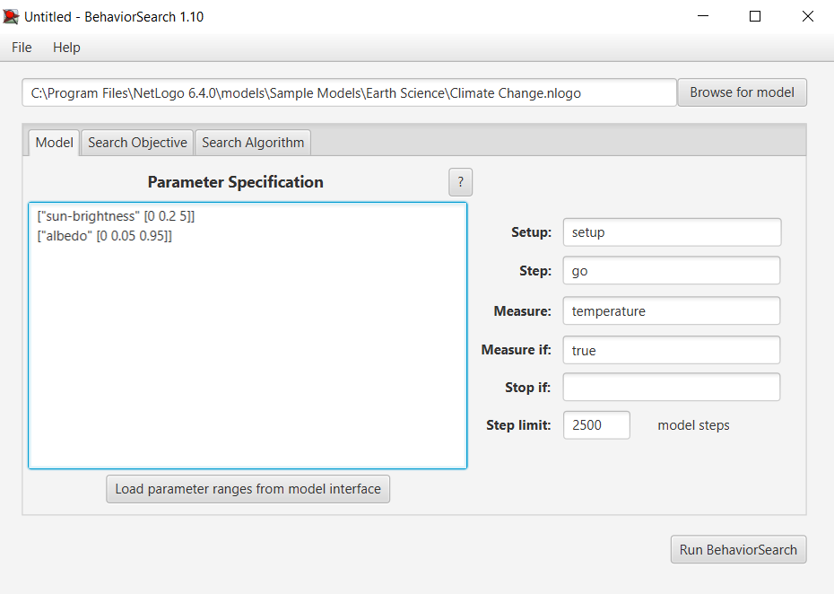
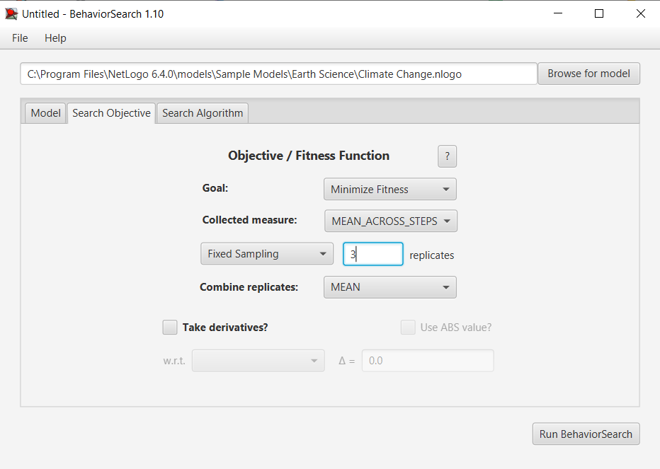
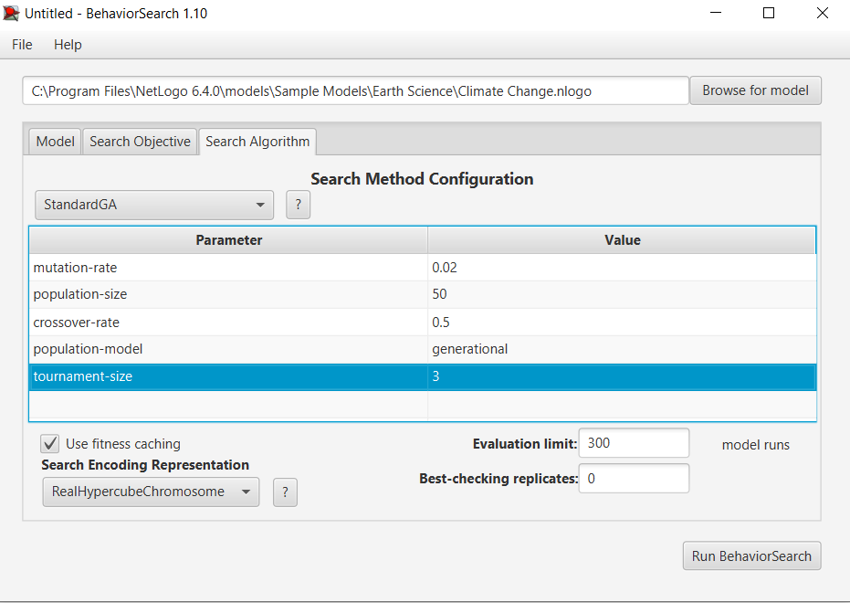
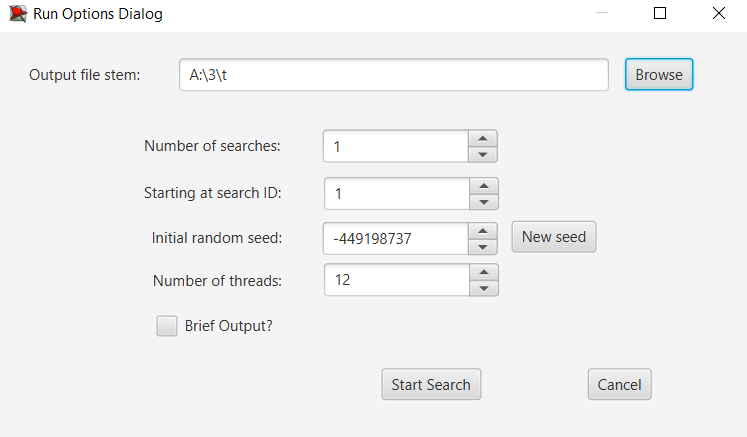
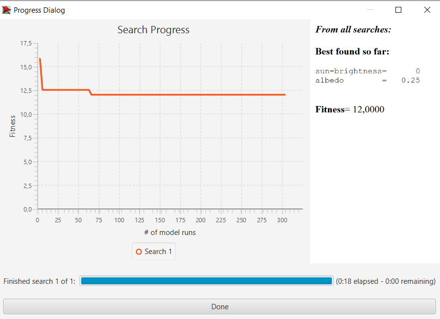
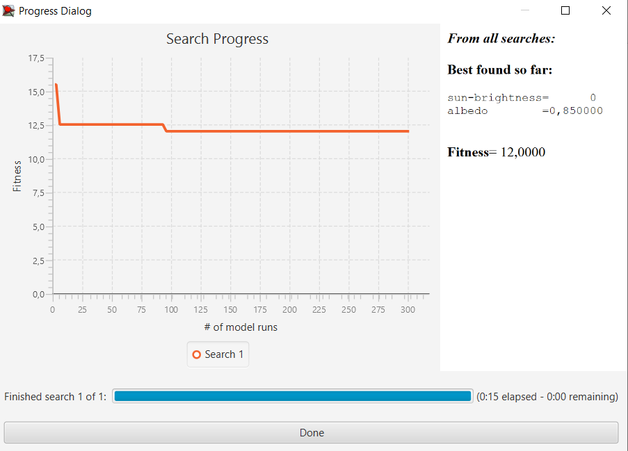

## Комп'ютерні системи імітаційного моделювання
## СПм-22-6, **Паронікян Папін Арменович**
### Лабораторна робота №**3**. Використання засобів обчислювального интелекту для оптимізації імітаційних моделей

 

### Варіант 2, модель у середовищі NetLogo:
[Climate Change](http://www.netlogoweb.org/launch#http://www.netlogoweb.org/assets/modelslib/Sample%20Models/Earth%20Science/Climate%20Change.nlogo)
Насправді, була обрана модель з 2 лабораторної роботи. Вона сильніше підходе для цієї лабораторної роботи і взагалі модифікована версія цікавіша.
 

#### Вербальний опис моделі:
**Встав сюди посилання на першу лабу**

### Налаштування середовища BehaviorSearch:

**Обрана модель**:
<pre>
C:\Program Files\Climate_Change-ext.nlogo
</pre>
**Параметри моделі** (вкладка Model):  
<pre>
["sun-brightness" [0 0.2 5]]
["albedo" [0 0.05 0.95]]
</pre>
Використовувана **міра**:  
Для фітнес-функції було обрано **значення температури Землі**, вираз для її розрахунку взято з коду моделі:
<pre>
  globals [
  temperature  ;; overall temperature
]
</pre>
та вказано у параметрі "**Measure**":
<pre>
temperature
</pre>
Температура враховується **в середньому** за весь період симуляції тривалістю, 2500 тактів (адже на кожному такті є своє значення температури), починаючи з 0 такту симуляції.  
Параметр зупинки за умовою ("**Stop if**") не використовувався.  
Загальний вигляд вкладки налаштувань параметрів моделі:  

**Налаштування цільової функції** (вкладка Search Objective):  
Метою підбору параметрів імітаційної моделі, що описує рух енергії в Землі, є **мініміація** значення температури, це вказано через параметр "**Goal**" зі значенням **Minimize Fitness**. Тобто необхідно визначити такі параметри налаштувань моделі, у яких температура приймає мінімальне значення. При цьому цікавить не просто температура у якийсь окремий момент симуляції, а середнє її значення за всю симуляцію. Для цього у параметрі "**Collected measure**", що визначає спосіб обліку значень обраного показника, вказано **MEAN_ACROSS_STEPS**.  
Щоб уникнути викривлення результатів через випадкові значення, що використовуються в логіці самої імітаційної моделі, **кожна симуляція повторюється по 3 рази**, результуюче значення розраховується як **середнє арифметичне**. 
Загальний вигляд вкладки налаштувань цільової функції:  

**Налаштування алгоритму пошуку** (вкладка Search Algorithm):  
Загальний вид вкладки налаштувань алгоритму пошуку:  

 

### Результати використання BehaviorSearch:
Діалогове вікно запуску пошуку 

Результат пошуку параметрів імітаційної моделі, використовуючи **генетичний алгоритм**:

Результат пошуку параметрів імітаційної моделі, використовуючи **випадковий пошук**:

